# MicAI Technical Specification

## Status and source boundary

This specification targets the P0 prototype in `BRIEF.md`. The following claims were verified directly:

- FluidAudio `v0.15.5`, resolved by SwiftPM at commit `19600a485baa4998812e4654b70d2bab8f2c9949`.
- Codex CLI `0.151.0` is installed at `~/.local/bin/codex`; `codex login status` reports ChatGPT authentication and a synthetic ephemeral command returned `HELLO`.
- Official OpenAI documentation defines `codex exec` as the non-interactive surface for scripted local runs. MicAI delegates authentication and transport to that supported surface and never reads OAuth credential files.
- Apple API usage below is limited to documented framework-level contracts. OS-version-specific behavior that has not been exercised is in Open questions.

## Architecture

```mermaid
flowchart LR
  User[User + target app] --> Hotkeys[Global hotkey monitor]
  Hotkeys --> Session[Operation coordinator]
  Session --> Capture[AVAudioEngine capture]
  Capture --> Samples[16 kHz mono Float32]
  Samples --> ASR[FluidAudio Parakeet v2 adapter]
  ASR --> Clean[Deterministic transcript cleanup]
  Clean --> Route{Mode}
  Route -->|Dictation| Insert[Insertion coordinator]
  Route -->|AI Command| Command[Command engine]
  Selection[Selection capture] --> Command
  Auth[Signed-in Codex CLI] --> LLM[Ephemeral codex exec client]
  Command --> LLM
  LLM --> Insert
  Insert --> Direct[Accessibility selected-text insertion]
  Insert --> Pasteboard[Guarded clipboard fallback]
  Pasteboard --> Events[CGEvent Cmd+C / Cmd+V]
  Direct --> Target[Frontmost target app]
  Pasteboard --> Target[Frontmost target app]
  Events --> Target
  Session --> HUD[Recording/status HUD]
  Settings[Settings + onboarding] --> Hotkeys
  Settings --> ASR
  Settings --> LLM
  Settings --> Login[SMAppService launch at login]
```



Dependency direction:

- `MicAICore` owns domain types, operation state, audio/ASR/LLM abstractions, adapters that do not require AppKit, command routing, and testable insertion transaction logic.
- `MicAI` owns SwiftUI/AppKit scenes, global key monitoring, pasteboard and CGEvent implementations, frontmost-app checks, permissions, and app lifecycle.
- `MicAI` depends on `MicAICore`. `MicAICore` never imports `MicAI`.

## Package and module layout

### `MicAICore` library

#### Domain and operation state

Responsibilities:

- Represent dictation versus command operations.
- Enforce one active operation and monotonic state transitions.
- Bind every async result to an operation ID so cancellation makes late results inert.

Public interface:

```swift
public enum MicAIMode: Sendable {
  case dictation
  case command
}

public enum OperationPhase: Sendable, Equatable {
  case idle
  case recording
  case transcribing
  case awaitingLLM
  case inserting
  case failed(MicAIError)
}

public actor OperationCoordinator {
  public func begin(mode: MicAIMode, target: TargetIdentity) throws -> UUID
  public func stopRecording(operationID: UUID) async
  public func cancel(operationID: UUID) async
}
```

#### Audio capture

Responsibilities:

- Wrap `AVAudioEngine` input capture.
- Produce normalized mono Float32 samples at 16,000 Hz.
- Publish a normalized level for the HUD.
- Stop and tear down taps deterministically.

Public interface:

```swift
public struct RecordedAudio: Sendable {
  public let samples: [Float]
  public let sampleRate: Int
  public let duration: Duration
}

public protocol AudioCapturing: Sendable {
  func start(levels: @escaping @Sendable (Float) -> Void) async throws
  func stop() async throws -> RecordedAudio
  func cancel() async
}
```

The adapter must reject concurrent starts and must remove the input tap on stop, cancellation, and error.

#### ASR

Responsibilities:

- Pin all FluidAudio-specific types behind one adapter.
- Download/load Parakeet TDT 0.6b v2 and expose progress.
- Create a fresh decoder state for each utterance.
- Return text and timing metadata without exposing FluidAudio to the command engine.

Public interface:

```swift
public struct Transcript: Sendable, Equatable {
  public let text: String
  public let audioDuration: TimeInterval
  public let processingDuration: TimeInterval
  public let confidence: Float
}

public enum ModelPreparationState: Sendable, Equatable {
  case notDownloaded
  case preparing(fraction: Double, phase: String)
  case ready
  case failed(String)
}

public protocol SpeechRecognizing: Sendable {
  func prepare(progress: @escaping @Sendable (ModelPreparationState) -> Void) async throws
  func transcribe(samples: [Float]) async throws -> Transcript
}
```

#### Transcript cleanup

P0 cleanup is deterministic: trim outer whitespace, collapse unintended runs of horizontal whitespace, and normalize whitespace around newlines. It must not summarize, rephrase, invent punctuation, or use the network. Additional rules remain an open product decision.

```swift
public protocol TranscriptCleaning: Sendable {
  func clean(_ text: String) -> String
}
```

#### Codex CLI and LLM

Responsibilities:

- Locate the executable through `MICAI_CODEX_BIN`, `PATH`, or standard local install paths.
- Run `codex exec` with `--ephemeral`, read-only sandboxing, and an isolated temporary directory.
- Send JSON-encoded instruction and selected text over stdin, never process arguments.
- Terminate the child on cancellation or timeout and accept only a successful, nonempty stdout result.
- Delegate ChatGPT login, workspace selection, token refresh, and transport to Codex.

```swift
public struct LLMRequest: Sendable {
  public let instruction: String
  public let selectedText: String?
  public let model: String
  public let sessionID: UUID
}

public protocol LLMTransforming: Sendable {
  func transform(_ request: LLMRequest) async throws -> String
}
```

MicAI never reads or parses `~/.codex/auth.json`. The optional model string is omitted from the CLI invocation when blank so the subscription default applies.

#### Command engine

Responsibilities:

- Route selection-present requests to replacement and selection-absent requests to insertion.
- Serialize instruction and selected text as separate JSON properties inside the user input text.
- Require a completed, nonempty LLM response before producing an insertion intent.

```swift
public enum InsertionIntent: Sendable, Equatable {
  case insert(String)
  case replaceSelection(String)
}

public struct CommandEngine: Sendable {
  public func execute(
    instruction: String,
    selectedText: String?,
    model: String
  ) async throws -> InsertionIntent
}
```

#### Adaptive insertion transaction

MicAI first writes through the focused Accessibility element's selected-text attribute. The AppKit pasteboard adapter is the fallback; its save/write/restore policy lives behind injected ports so both strategies can be unit-tested in `MicAICoreTests`.

```swift
public struct PasteboardSnapshot: Sendable, Equatable {
  public let items: [[String: Data]]
  public let changeCount: Int
}

public protocol PasteboardAccessing: Sendable {
  func snapshot() throws -> PasteboardSnapshot
  func writePlainText(_ text: String) throws -> Int
  func restore(_ snapshot: PasteboardSnapshot) throws
  func currentChangeCount() -> Int
}

public protocol KeyboardSynthesizing: Sendable {
  func copy() throws
  func paste() throws
}

public actor TextInsertionCoordinator {
  public func readSelection() async throws -> String?
  public func apply(_ intent: InsertionIntent, to target: TargetIdentity) async throws
}
```

Restoration rule: restore the original snapshot only when the current pasteboard change count still equals the count produced by MicAI's own temporary write. If another process changed the pasteboard, do not overwrite the newer content; report `clipboardChanged` diagnostically.

### `MicAI` executable

| Component | Responsibility |
| --- | --- |
| `MicAIApp` | `MenuBarExtra`, Settings scene, app lifecycle, `LSUIElement` utility behavior |
| `AppModel` | Main-actor projection of operation, permission, model, and provider state |
| `GlobalHotkeyMonitor` | Right Option default, configurable command hotkey, hold/toggle semantics, key-repeat suppression |
| `RecordingHUDController` | Borderless floating `NSPanel` with state, level, and cancellation presentation |
| `SystemPasteboardAdapter` | Snapshot and restore all `NSPasteboardItem` data representations |
| `CGEventKeyboardSynthesizer` | Post Cmd+C and Cmd+V key-down/key-up pairs |
| `TargetApplicationTracker` | Capture and revalidate frontmost process identity before insertion |
| `PermissionService` | Microphone state/request and Accessibility trust prompt/status |
| `LaunchAtLoginService` | Map Settings toggle to `SMAppService.mainApp.register()` / `unregister()` and expose status |
| `SettingsStore` | UserDefaults-backed hotkeys, mode, model string, onboarding completion, no secrets |

## Data flows

### Dictation: audio to insertion

1. Hotkey down asks `OperationCoordinator` to begin dictation and records the frontmost target identity.
2. Permission preflight fails before capture if microphone or Accessibility is unavailable.
3. `AudioCapturing.start` installs the audio tap; the HUD enters recording and consumes level samples.
4. In hold mode, hotkey up calls stop. In toggle mode, the next non-repeat activation calls stop.
5. The audio adapter returns 16 kHz mono Float32 samples. An utterance shorter than FluidAudio's 0.3-second minimum is rejected as too short.
6. The HUD enters transcribing. `FluidAudioRecognizer` transcribes with Parakeet v2 and a new `TdtDecoderState`.
7. Deterministic cleanup produces final text. Empty output is an ASR failure, not an insertion.
8. The coordinator revalidates operation ID and target identity.
9. Insertion first tries the Accessibility selected-text attribute. If unsupported, it snapshots the general pasteboard, writes the transcript, synthesizes Cmd+V, waits a short bounded interval, and conditionally restores the snapshot.
10. The operation returns to idle and dismisses the HUD.

No raw audio or ordinary dictation transcript is sent to the network.

### AI Command: selection and instruction to LLM

1. Command-hotkey down begins a command operation and records target identity.
2. Selection capture snapshots the pasteboard, synthesizes Cmd+C, reads plain text if copy produced one, and restores using the guarded rule. No copied text is interpreted as an empty selection only when the copy transaction itself succeeded.
3. MicAI records the spoken instruction and transcribes it locally through the same v2 adapter.
4. `CommandEngine` builds a request with separate `instruction` and `selected_text` values. Raw audio is discarded and is never sent.
5. `CodexCLIClient` starts an ephemeral, read-only `codex exec` child and sends the JSON payload over stdin.
6. A missing CLI, authorization failure, timeout, cancellation, nonzero exit, or empty stdout becomes a typed error. No failure causes token-file access or fallback.
7. The coordinator discards output if cancelled or if the target changed.
8. Nonempty output replaces the existing selection or inserts at the cursor via the adaptive insertion transaction.

## Verified FluidAudio integration

### Resolution evidence

The root throwaway package resolved:

```text
https://github.com/FluidInference/FluidAudio @ 0.15.5
commit 19600a485baa4998812e4654b70d2bab8f2c9949
```

The v2 enum maps to `FluidInference/parakeet-tdt-0.6b-v2-coreml` in the resolved source. The following declarations are quoted from the public source, not inferred from the README.

From [`AsrModels.swift`](https://github.com/FluidInference/FluidAudio/blob/v0.15.5/Sources/FluidAudio/ASR/Parakeet/SlidingWindow/TDT/AsrModels.swift):

```swift
public enum AsrModelVersion: Sendable {
    case v2
    case v3
    case tdtCtc110m
    case tdtJa
}

public static func downloadAndLoad(
    to directory: URL? = nil,
    configuration: MLModelConfiguration? = nil,
    version: AsrModelVersion = .v3,
    encoderPrecision: ParakeetEncoderPrecision = .int8,
    encoderComputeUnits: MLComputeUnits? = nil,
    progressHandler: ProgressHandler? = nil
) async throws -> AsrModels

public static func defaultCacheDirectory(for version: AsrModelVersion = .v3) -> URL
```

From [`DownloadTypes.swift`](https://github.com/FluidInference/FluidAudio/blob/v0.15.5/Sources/FluidAudio/Shared/Download/DownloadTypes.swift):

```swift
public enum DownloadPhase: Sendable {
    case listing
    case downloading(completedFiles: Int, totalFiles: Int)
    case compiling(modelName: String)
}

public struct DownloadProgress: Sendable {
    public let fractionCompleted: Double
    public let phase: DownloadPhase
}

public typealias ProgressHandler = @Sendable (DownloadProgress) -> Void
```

From [`AsrManager.swift`](https://github.com/FluidInference/FluidAudio/blob/v0.15.5/Sources/FluidAudio/ASR/Parakeet/SlidingWindow/TDT/AsrManager.swift):

```swift
public init(config: ASRConfig = .default, models: AsrModels? = nil)

public func loadModels(_ models: AsrModels) async throws

public func transcribe(
    _ audioSamples: [Float],
    decoderState: inout TdtDecoderState,
    language: Language? = nil
) async throws -> ASRResult
```

From [`TdtDecoderState.swift`](https://github.com/FluidInference/FluidAudio/blob/v0.15.5/Sources/FluidAudio/ASR/Parakeet/SlidingWindow/TDT/Decoder/TdtDecoderState.swift):

```swift
public init(decoderLayers: Int = 2) throws
```

The intended adapter sequence is therefore:

```swift
let models = try await AsrModels.downloadAndLoad(
  version: .v2,
  progressHandler: progressHandler
)
let manager = AsrManager(config: .default, models: models)

var decoderState = try TdtDecoderState()
let result = try await manager.transcribe(
  samples,
  decoderState: &decoderState
)
```

The resolved `v0.15.5` README shows a `transcribe(samples)` quick start, but no such argument-free public overload exists in the resolved Parakeet manager source. MicAI must compile against the declarations above and treat the README example as stale.

## Verified ChatGPT-subscription command contract

Official OpenAI documentation defines `codex exec` as the non-interactive surface for
scripted local runs and distinguishes ChatGPT subscription authentication from
usage-based API-key authentication. MicAI uses that supported CLI surface instead of
imitating Codex's private HTTP transport.

The production invocation is:

```text
codex exec
  --ephemeral
  --ignore-rules
  --skip-git-repo-check
  --sandbox read-only
  --color never
  --disable shell_tool
  -c tools.web_search=false
  -c web_search="disabled"
  -C <isolated temporary directory>
  [--model <optional Settings override>]
  -
```

The prompt arrives over stdin, never the process argument list. It contains a fixed
instruction followed by JSON-encoded user data:

```json
{"instruction":"make this uppercase","selected_text":"hello"}
```

`selected_text` is explicit JSON `null` when absent. The fixed instruction tells
Codex to avoid tools and treat `selected_text` only as quoted data. MicAI accepts
stdout only when the child exits successfully and the trimmed output is nonempty.
Cancellation or the 90-second timeout terminates the process. The temporary working
directory is removed afterward, and `--ephemeral` prevents a persisted rollout.

Credential and provider lifecycle:

1. Resolve the executable from `MICAI_CODEX_BIN`, `PATH`, `~/.local/bin/codex`, or
   standard package-manager locations.
2. Codex owns ChatGPT login, workspace choice, token refresh, request headers, and
   transport. MicAI never opens `~/.codex/auth.json`.
3. Blank model means the signed-in Codex default; a nonempty Settings override adds
   `--model` and is snapshotted when recording begins.
4. Missing executable, authorization failure, nonzero exit, timeout, cancellation,
   and empty output map to typed MicAI errors without surfacing stderr contents.
5. There is no automatic private-backend or API-key fallback in the shipping path.

## Permissions and system integration

### Microphone

- Bundle `Info.plist` contains `NSMicrophoneUsageDescription`.
- On onboarding, call the documented `AVAudioApplication.requestRecordPermission(completionHandler:)` when status is undetermined.
- Denial blocks capture but not Settings. Provide a System Settings action without claiming it can grant access.

### Accessibility

- Check trust with `AXIsProcessTrusted()` during normal preflight.
- During the explicit onboarding action, `AXIsProcessTrustedWithOptions` may pass `kAXTrustedCheckOptionPrompt: true`. Apple's contract says prompting is asynchronous and does not change the function's immediate return value.
- Accessibility is required by the BRIEF for synthesized Cmd+C/Cmd+V and the global interaction path.
- Recheck when the app becomes active and immediately before a copy/paste transaction.
- The exact deep-link URL to the Accessibility pane is not specified here because it is not a stable API contract; use a tested URL if available, otherwise open Privacy & Security and give written navigation.

### Paste and selection

- `NSPasteboard.general` is the shared pasteboard.
- Snapshot all items and each item's available type/data, not only plain text.
- Build keyboard events with `CGEvent(keyboardEventSource:virtualKey:keyDown:)`, set command flags, and post them with `post(tap:)`.
- P0 uses the standard virtual key code for the V or C physical key plus the Command flag; validate on the target keyboard layout.
- The copy/paste delay is a measured implementation constant, not an Apple guarantee.

### Launch at login

- Use `SMAppService.mainApp`.
- Enabling calls `register()`; disabling calls `unregister()`.
- Surface `status` including requires-approval instead of assuming registration means enabled.

Apple references: [MenuBarExtra](https://developer.apple.com/documentation/swiftui/menubarextra), [AXIsProcessTrustedWithOptions](https://developer.apple.com/documentation/applicationservices/1459186-axisprocesstrustedwithoptions), [CGEvent](https://developer.apple.com/documentation/coregraphics/cgevent), [NSPasteboard](https://developer.apple.com/documentation/appkit/nspasteboard), and [SMAppService register](https://developer.apple.com/documentation/servicemanagement/smappservice/register%28%29).

## Error taxonomy

| Code | Trigger | User-visible response | Retry policy |
| --- | --- | --- | --- |
| `microphoneDenied` | Permission not granted | Explain and open settings action | After user changes permission |
| `accessibilityDenied` | Process not trusted | Explain copy/paste/hotkey need | After user changes permission |
| `hotkeyConflict` | Duplicate/reserved/unavailable binding | Keep prior binding | After configuration change |
| `audioUnavailable` | No input, engine/tap failure | Return to idle; retain no audio | Manual retry |
| `audioTooShort` | Fewer than 0.3 s of samples | Brief HUD message; no insertion | Speak again |
| `modelUnavailable` | Model absent and offline | Show model status | Retry download |
| `modelDownloadFailed` | Listing/download/compile/load fails | Preserve phase/error; no fake ready state | Explicit retry |
| `asrNotInitialized` | Manager has no loaded models | Return to model status | Prepare then retry |
| `asrFailed` | FluidAudio processing error or empty text | No insertion | Manual retry |
| `codexCLIUnavailable` | Executable cannot be resolved | Install-path guidance | Install Codex or set `MICAI_CODEX_BIN` |
| `credentialMissing` | Codex CLI is not signed in | Provider setup message | Run `codex login` |
| `llmUnauthorized` | CLI reports authorization failure | Ask user to refresh Codex login | No token inspection |
| `llmServerFailure` | Nonzero exit, timeout, or process failure | Preserve selection | Manual retry after diagnosis |
| `llmIncomplete` | Successful process returns empty stdout | Discard output | Manual retry |
| `targetChanged` | Frontmost target no longer matches | Withhold insertion | User restores target |
| `clipboardChanged` | Other process changes clipboard | Do not restore stale snapshot | Operation may still succeed |
| `insertionFailed` | Event construction/post or paste fails | No second blind paste | Manual retry |
| `cancelled` | Esc or explicit cancel | Silent/brief cancelled state | Not an error |

Errors are typed and safe for UI. Underlying errors may be logged locally only after redacting paths and all credential/request content.

## State and concurrency rules

- `OperationCoordinator` is an actor and permits exactly one active operation.
- Each operation owns a UUID and cancellation handle.
- Hotkey auto-repeat is ignored.
- Model preparation is single-flight; additional callers observe the same state.
- Audio capture, ASR, LLM, and insertion check cancellation between stages.
- Only the active operation ID can request insertion.
- UI mutations occur on `MainActor`.
- Credentials and selected text are not placed in `UserDefaults`, analytics, process arguments, or persistent MicAI logs.

## No-Xcode build and packaging

The root package replaces the grounding-only manifest during implementation:

```text
Package.swift
Sources/
  MicAICore/
  MicAI/
Tests/
  MicAICoreTests/
```

The manifest declares macOS 14 or later, a `MicAICore` library target, a `MicAI` executable target, a `MicAICoreTests` test target, and exact FluidAudio `0.15.5` dependency resolution.

`scripts/codex-build.sh` performs only command-line operations:

1. `swift build -c release`.
2. Create `dist/MicAI.app/Contents/MacOS` and `Contents/Resources`.
3. Copy the release `MicAI` binary into `Contents/MacOS/MicAI`.
4. Generate `Contents/Info.plist` with at least `CFBundleExecutable`, `CFBundleIdentifier`, `CFBundleName`, `CFBundlePackageType=APPL`, `CFBundleShortVersionString`, `CFBundleVersion`, `LSMinimumSystemVersion=14.0`, `LSUIElement=true`, and `NSMicrophoneUsageDescription`.
5. Run `codesign --force --deep -s - dist/MicAI.app`.
6. Verify with `codesign --verify --deep --strict dist/MicAI.app`.

No storyboard, xib, asset catalog, `xcodebuild`, or Xcode project is used. UI symbols use SF Symbols or code-drawn content. `dist/`, `.build/`, and runtime models remain untracked.

## Test strategy

### Unit tests in `MicAICoreTests`

- Operation routing for dictation, command replacement, and command insertion.
- State-machine legality, exclusivity, cancellation, and stale-result rejection.
- Deterministic transcript cleanup.
- Codex CLI executable resolution, ephemeral/read-only arguments, stdin JSON privacy, default/override models, authorization failure, timeout/cancellation mapping, and empty output.
- Direct Accessibility insertion with proof that the clipboard remains untouched, plus guarded fallback behavior.
- Clipboard snapshot/write/restore with an injected pasteboard, including multi-item data, unchanged count restore, and concurrent-change no-clobber behavior.
- Hotkey mode transition logic independent of the event tap.

Tests use injected process runners and fake insertion boundaries. They never read the real auth file.

### Integration tests without live external state

- Compile the FluidAudio adapter against `v0.15.5` to catch signature drift.
- Use an injected `CodexCommandRunning` boundary for child-process integration.
- Use fake audio/ASR/LLM/pasteboard/keyboard implementations for end-to-end coordinator tests.
- Run `bash scripts/codex-test.sh` and `bash scripts/codex-typecheck.sh`.

### Manual target-machine verification

- First-run microphone and Accessibility flows.
- Model download/progress and a known audio transcription.
- Push-to-talk and toggle behavior in TextEdit.
- Selection replacement and empty-selection drafting through the signed-in Codex CLI, without displaying credentials.
- Esc at every asynchronous phase.
- Focus-change insertion withholding.
- Multi-format clipboard preservation.
- Launch-at-login status after logout/login when practical.
- Clean packaging, ad-hoc signature, menu icon, no Dock icon.

## Open questions

1. Should MicAI expose the Codex CLI's model list, or keep the blank-default plus advanced string override?
2. Should Command Mode use a dedicated managed Codex profile when the CLI adds a supported no-tools profile contract?
3. What child-process timeout best balances larger edits with fast failure recovery?
4. Does the target macOS 27 build require Input Monitoring as well as Accessibility for a Right Option global event tap, especially with an ad-hoc-signed app?
5. Which System Settings deep links remain functional on macOS 27 for Microphone, Accessibility, and Login Items?
6. What paste delay reliably lets the target app consume data before restoration, and should it adapt by app?
7. How should MicAI recover a valid result when the frontmost target changes while ASR or LLM work is pending?
8. Will repeated ad-hoc rebuilds at the chosen stable bundle path preserve TCC grants on the target machine?
9. Should model readiness call `AsrModels.modelsExist` against `defaultCacheDirectory(for: .v2)` or attempt load and report the richer error as the authoritative state?
